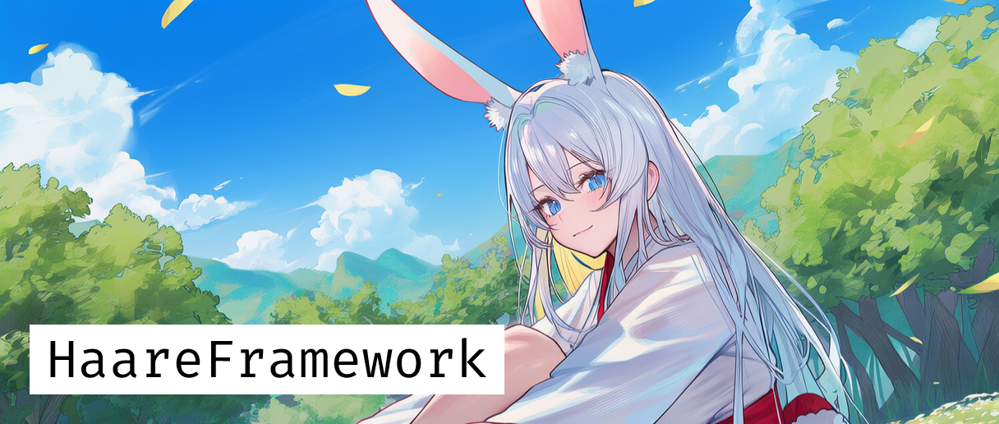

* 해당 프로젝트에서 사용된 이미지는 ai가 사용되었습니다.
# HaareFramework
**Unity UI 기반 게임을 위한 한마리 토끼**

> Hare가 아니라 Haare!

HaareFramework는 `VContainer`, `UniTask`, `R3`를 기반으로 생애주기와 코드의 흐름을 중앙에서 관리하고, DI를 통한 모듈화 구성을 목표로 만들어졌습니다. 

*이 프레임워크는 기반이 되는 프레임워크가 존재합니다!*
* [SubmarineMirageFramework]( 
https://github.com/FromSeabedOfReverie/SubmarineMirageFrameworkForUnity)

Processer,Routine 등의 Core 설계에 있어 많은 부분이 해당 프레임워크에서 수정을 하여 개발되었습니다. 멋진 구조와 코드를 설계해주신 원작자분들께 감사드립니다!
## Architecture

* **Routine 기반 생애주기 (`Processer` & `MonoRoutine`)**
    * `MonoBehaviour`를 대체하는 `MonoRoutine`을 기본 단위로 사용합니다.

    * `MonoRoutine`은 생성 시 `Processer`에 자동으로 등록되며, `Processer`는 등록된 모든 `Routine`의 생애주기(Update, FixedUpdate 등)를 중앙에서 관리합니다.

* **DI (`VContainer`)**
    * `CoreLifetimeScope`가 `SceneRoutine`과 같은 전역 싱글톤 서비스를 관리하며, 각 씬은 자체 `LifetimeScope`를 통해 해당 씬에 종속적인 `UIManager`, `Presenter` 등을 관리합니다.

* **MVP**
    * `IPresenter`를 구현한 Presenter가 각 씬의 진입점 역할을 수행합니다.
    * Presenter는 DI를 통해 `UIManager`, `SceneRoutine` 등 핵심 서비스를 주입받아, 사용자 입력(View)과 데이터(Model)를 중재하는 로직을 처리합니다.

* **Reactive 프로그래밍 (`R3`)**
    * `CustomButton`과 같은 UI 컴포넌트의 사용자 입력 이벤트는 `R3`의 `Observable`을 통해 외부에 노출됩니다. Presenter는 이 스트림을 구독(Subscribe)하여 반응형으로 로직을 처리합니다.

## Features

* **중앙화된 생애주기**: `Processer`를 통한 `MonoRoutine`의 체계적인 업데이트 및 생애주기 관리
* **패널 기반 UI 시스템**: `SceneUIManager`와 `ICustomPanel`을 활용한 스택 기반의 유연한 UI 관리

## Setup

### 사전 요구 사항

* Unity 2021.3 LTS 이상
* **Addressables** 패키지 설치
* **TextMeshPro** 패키지 설치

### 의존성 설치

본 프레임워크는 다음 라이브러리에 의존성을 가집니다.

**VContainer**
> `https://github.com/hadashiA/VContainer.git?path=VContainer/Assets/VContainer`

**R3**
> `https://github.com/Cysharp/R3.git?path=src/R3.Unity/Assets/R3.Unity`

**UniTask**
>`https://github.com/Cysharp/UniTask.git?path=src/UniTask/Assets/Plugins/UniTask`

## DEMO
> Assets/Haare/Demo/Scene/TitleScene.unity

씬에서 실행하시면 간단한 데모를 보실수 있답니다

## 📜 라이선스 (License)
이 프로젝트는 MIT 라이선스를 따릅니다. 자세한 내용은 LICENSE 파일을 확인해 주세요.